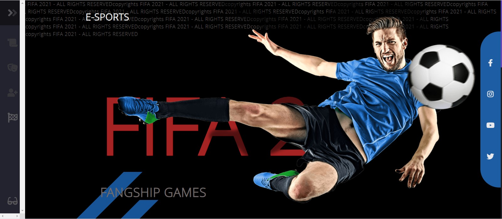
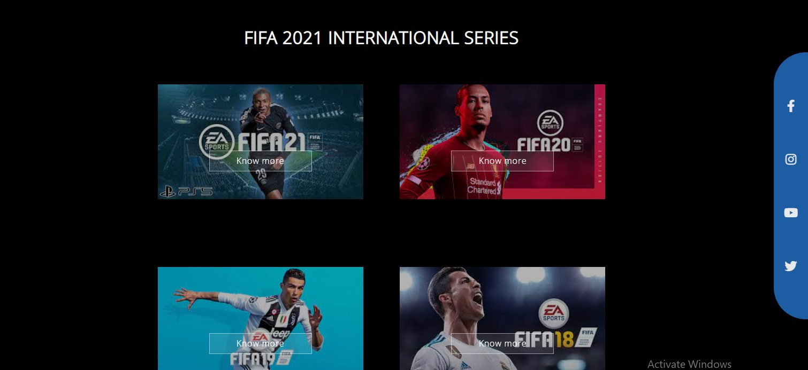
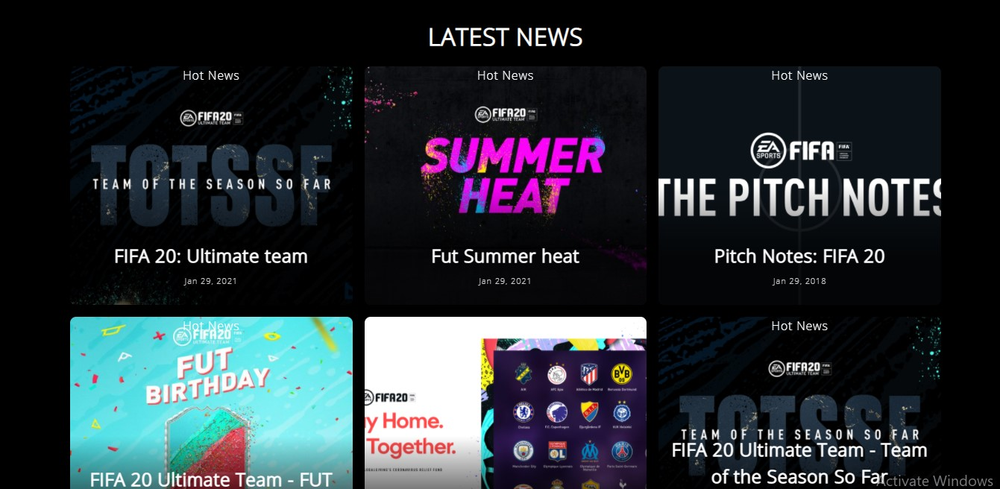
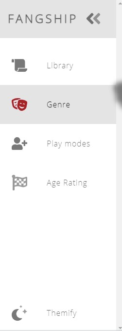
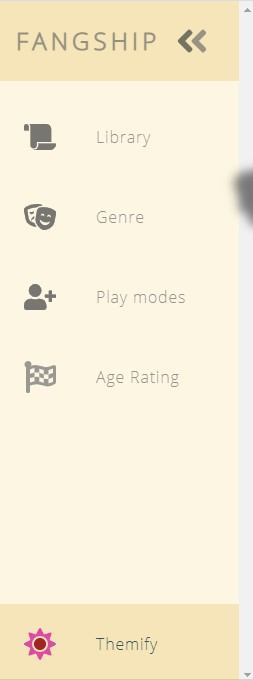
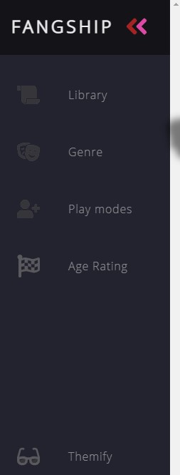

# E-sports-web-design

<h1 align="center">
    ✨ Fangship Gaming ✨
</h1>

 
<blockquote align="center"> <b><i>
    webpage is designed for a  web design competition.</i></b>
</blockquote>

## 📌 Prerequisites

### 💻 1. System requirement :

1. Any system with basic configuration.
2. Operating System : Any (Windows / Linux / Mac).
3. Download the zip and get access to the template.

### 💿 2. Software requirement :

1. Updated browser
2. Any text editor of your choice.

### ⚡ 3. Skill set :

1. HTML
2. CSS
3. JavaScript

## ⚡ Web design:

The webpase was  designed for  WebOCode competition conducted by IEEE computer society. We have taken E-Sports theme and did our best in the 24-hour online coding event. We had FIFA as a theme of the E-sports webisite and buile the homepage starting with a spectacular front page as depicted below.

Some other features and it's professional appearences of our webpage. 

We also implemented a side way navigation bar with 3 different themes. 
1. Solar
2. White
3. Dark

Thank you for providing us the opportunity. Hoping for the results.

